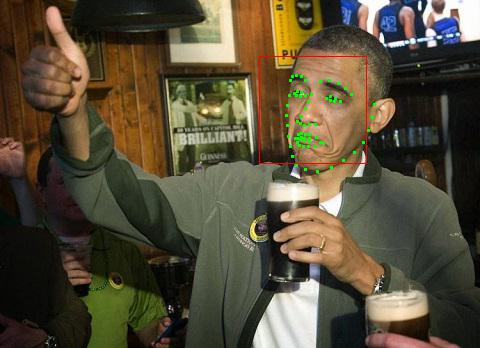

# 人工智能/Dlib 人脸识别

[dlib](http://dlib.net/) 是一个包含机器学习算法和工具的 c++ 库.

## 安装

```sh
$ git clone --depth=1 https://github.com/davisking/dlib.git
$ cd dlib
$ mkdir build; cd build; cmake .. ; cmake --build .
# 安装 python API
$ python setup.py install
```

详细请至 [https://github.com/davisking/dlib](https://github.com/davisking/dlib) 阅读官方文档.

**记录一: dlib Python API 需要 boost.python 支持**

简而言之, 前往 [http://www.boost.org/](http://www.boost.org/) 下载 boost 后, 使用如下命令安装即可, 注意使用 --with-python 配置 python 可执行文件, 安装脚本会自动寻找 python 的安装目录.

```sh
$ ./bootstrap.sh --prefix=/usr/local/boost --with-python=python3 --with-libraries=python
# CPLUS_INCLUDE_PATH 值为 pyconfig.h 所在路径
$ CPLUS_INCLUDE_PATH=/usr/local/python/include/python3.6m ./b2
$ ./b2 install
```

安装完毕后设置环境变量

```sh
export PATH=$PATH:/usr/local/boost/include
export LD_LIBRARY_PATH=$LD_LIBRARY_PATH:/usr/local/boost/lib
```

**记录二: 内存过小导致编译失败**

```text
c++: internal compiler error: Killed (program cc1plus)
Please submit a full bug report,
with preprocessed source if appropriate.
See <http://bugzilla.redhat.com/bugzilla> for instructions.
gmake[2]: *** [CMakeFiles/dlib_.dir/src/vector.cpp.o] Error 4
gmake[1]: *** [CMakeFiles/dlib_.dir/all] Error 2
gmake: *** [all] Error 2
error: cmake build failed!
```

测试时 1G 内存导致编译失败, 使用额外的 1G swap 后重新编译解决问题:

```sh
$ dd if=/dev/zero of=/data/swap bs=64M count=16
$ chmod 0600 /data/swap
$ mkswap /data/swap
$ swapon /data/swap
```

## 人脸检测

```py
import sys

import dlib
import skimage.draw
import skimage.io

load_name = sys.argv[1]
save_name = sys.argv[2]

detector = dlib.get_frontal_face_detector()

img = skimage.io.imread(load_name)
dets = detector(img, 1)
print('Number of faces detected: {}'.format(len(dets)))
for d in dets:
    r0, c0, r1, c1 = d.top(), d.left(), d.bottom(), d.right()
    print('Detection {}'.format([(r0, c0), (r1, c1)]))
    skimage.draw.set_color(img, skimage.draw.line(r0, c0, r0, c1), (255, 0, 0))
    skimage.draw.set_color(img, skimage.draw.line(r0, c1, r1, c1), (255, 0, 0))
    skimage.draw.set_color(img, skimage.draw.line(r1, c1, r1, c0), (255, 0, 0))
    skimage.draw.set_color(img, skimage.draw.line(r1, c0, r0, c0), (255, 0, 0))

skimage.io.imsave(save_name, img)
```

```sh
# 执行脚本
$ python3 face_detector.py obama.jpg obama_face.jpg
```

原图:


人脸:


## 人脸标注

```py
import sys

import dlib
import skimage.draw
import skimage.io

predictor_path = 'shape_predictor_68_face_landmarks.dat'
load_name = sys.argv[1]
save_name = sys.argv[2]

detector = dlib.get_frontal_face_detector()
sp = dlib.shape_predictor(predictor_path)

img = skimage.io.imread(load_name)
dets = detector(img, 1)
print('Number of faces detected: {}'.format(len(dets)))
for i, d in enumerate(dets):
    r0, c0, r1, c1 = d.top(), d.left(), d.bottom(), d.right()
    print(i, 'Detection {}'.format([(r0, c0), (r1, c1)]))
    skimage.draw.set_color(img, skimage.draw.line(r0, c0, r0, c1), (255, 0, 0))
    skimage.draw.set_color(img, skimage.draw.line(r0, c1, r1, c1), (255, 0, 0))
    skimage.draw.set_color(img, skimage.draw.line(r1, c1, r1, c0), (255, 0, 0))
    skimage.draw.set_color(img, skimage.draw.line(r1, c0, r0, c0), (255, 0, 0))

    shape = [(p.x, p.y) for p in sp(img, d).parts()]
    print('Part 0: {}, Part 1: {} ...'.format(shape[0], shape[1]))
    for i, pos in enumerate(shape):
        skimage.draw.set_color(img, skimage.draw.circle(pos[1], pos[0], 2), (0, 255, 0))

skimage.io.imsave(save_name, img)
```

```sh
# 在使用该脚本前, 需要先下载预训练权重
$ wget http://dlib.net/files/shape_predictor_68_face_landmarks.dat.bz2
$ bunzip2 shape_predictor_68_face_landmarks.dat.bz2
# 执行脚本, 保存结果至 obama_face_landmark.jpg
$ python3 face_landmark_detection.py obama.jpg obama_landmark.jpg
```



## 人脸识别

在上文中已经从图像中提取到人脸特征点, 人脸识别的基本的步骤为: 将特征点编码为特征矩阵, 并计算两个特征矩阵之间的欧几里得距离, 当距离小于指定阈值时, 则认为是同一个人.

dlib 中的一些注释解释了这一切(大致是将人脸特征点编码为 128 维向量, 如果两特征向量的欧几里得距离 < 0.6 则认为是同一个人).

```py
#   This example shows how to use dlib's face recognition tool.  This tool maps
#   an image of a human face to a 128 dimensional vector space where images of
#   the same person are near to each other and images from different people are
#   far apart.  Therefore, you can perform face recognition by mapping faces to
#   the 128D space and then checking if their Euclidean distance is small
#   enough.
#
#   When using a distance threshold of 0.6, the dlib model obtains an accuracy
#   of 99.38% on the standard LFW face recognition benchmark, which is
#   comparable to other state-of-the-art methods for face recognition as of
#   February 2017. This accuracy means that, when presented with a pair of face
#   images, the tool will correctly identify if the pair belongs to the same
#   person or is from different people 99.38% of the time.
#
#   Finally, for an in-depth discussion of how dlib's tool works you should
#   refer to the C++ example program dnn_face_recognition_ex.cpp and the
#   attendant documentation referenced therein.
```

下面来测试下, 下载预训练权重并编写如下代码

```sh
$ wget http://dlib.net/files/dlib_face_recognition_resnet_model_v1.dat.bz2
$ bunzip2 dlib_face_recognition_resnet_model_v1.dat.bz2
```

```py
import sys

import dlib
import numpy as np
import skimage.draw
import skimage.io

predictor_path = 'shape_predictor_68_face_landmarks.dat'
face_rec_model_path = 'dlib_face_recognition_resnet_model_v1.dat'
load_name_0 = sys.argv[1]
load_name_1 = sys.argv[2]

detector = dlib.get_frontal_face_detector()
sp = dlib.shape_predictor(predictor_path)
facerec = dlib.face_recognition_model_v1(face_rec_model_path)


def get_descriptor(load_name):
    img = skimage.io.imread(load_name)
    dets = detector(img, 1)
    assert len(dets) == 1
    shape = sp(img, dets[0])
    face_descriptor = facerec.compute_face_descriptor(img, shape)
    face_descriptor = np.array(face_descriptor)
    assert face_descriptor.shape == (128,)
    return face_descriptor


x0 = get_descriptor(load_name_0)
x1 = get_descriptor(load_name_1)

# 计算两个特征矩阵的欧几里得距离 d, 当 d < 0.6 时, 则认为是同一个人
d = np.linalg.norm(x0 - x1)
print('distance', d)
```

拿两张神仙的脸测试一下:


结果是 0.333517042672, 是同一个人没错(长舒一口气).

## 人脸聚类

人脸聚类属于无监督学习. 当你有许多未标记的待分类的照片时, 使用人脸聚类是非常有用的. 待分类目录下有两张神仙的肖像和两张观海的肖像, 使用如下代码可以将神仙和观海分开.


```py
import os
import sys

import dlib
import skimage.draw
import skimage.io


predictor_path = 'shape_predictor_68_face_landmarks.dat'
face_rec_model_path = 'dlib_face_recognition_resnet_model_v1.dat'
faces_folder_path = sys.argv[1]

detector = dlib.get_frontal_face_detector()
sp = dlib.shape_predictor(predictor_path)
facerec = dlib.face_recognition_model_v1(face_rec_model_path)

face_results = []

for entry in os.scandir(faces_folder_path):
    print(f'Processing file: {entry.path}')
    img = skimage.io.imread(entry.path)
    dets = detector(img, 1)
    print("Number of faces detected: {}".format(len(dets)))
    for k, d in enumerate(dets):
        shape = sp(img, d)
        face_descriptor = facerec.compute_face_descriptor(img, shape)
        face_results.append({
            'path': entry.path,
            'det': d,
            'shape': shape,
            'descriptor': face_descriptor
        })

labels = dlib.chinese_whispers_clustering([e['descriptor'] for e in face_results], 0.5)
num_classes = len(set(labels))
print("Number of clusters: {}".format(num_classes))
for i, r in enumerate(face_results):
    r['label'] = labels[i]

for e in face_results:
    path = e['path']
    d = e['det']
    det = [d.top(), d.left(), d.bottom(), d.right()]
    label = e['label']
    print(label, path, det)
```

**执行结果**

```sh
$ python3 run.py face_tests/

Processing file: face_tests/crystal_01.jpg
Number of faces detected: 1
Processing file: face_tests/crystal_02.jpg
Number of faces detected: 1
Processing file: face_tests/obama_01.jpg
Number of faces detected: 1
Processing file: face_tests/obama_02.jpg
Number of faces detected: 1
Number of clusters: 2
0 face_tests/crystal_01.jpg [116, 201, 270, 356]
0 face_tests/crystal_02.jpg [64, 236, 219, 390]
1 face_tests/obama_01.jpg [38, 146, 113, 220]
1 face_tests/obama_02.jpg [63, 71, 138, 146]
```
