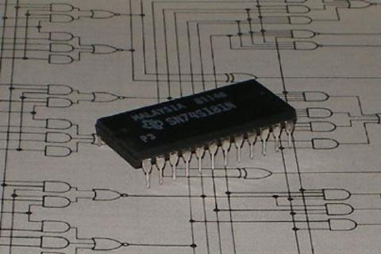
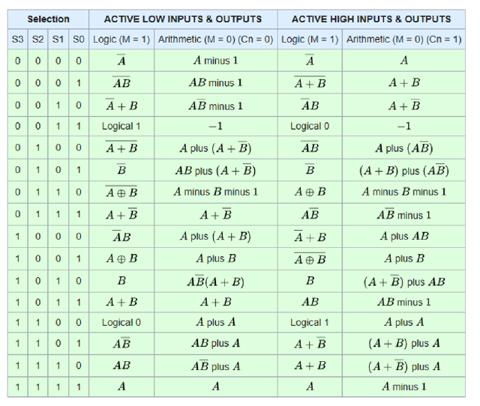
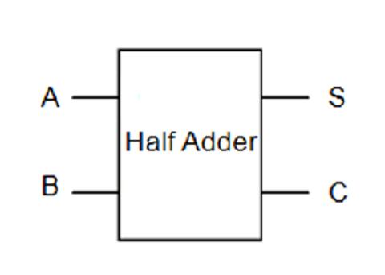
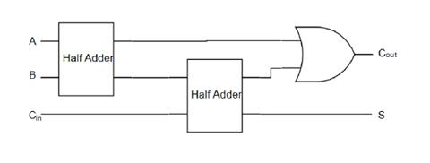
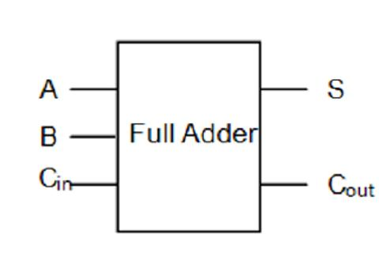
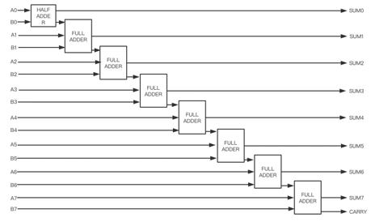
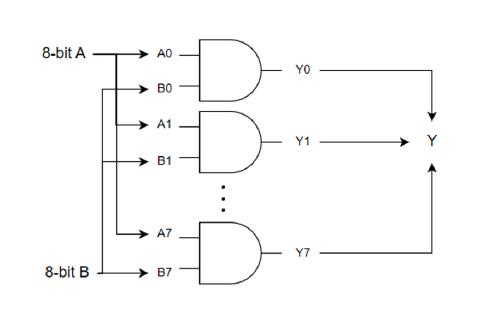
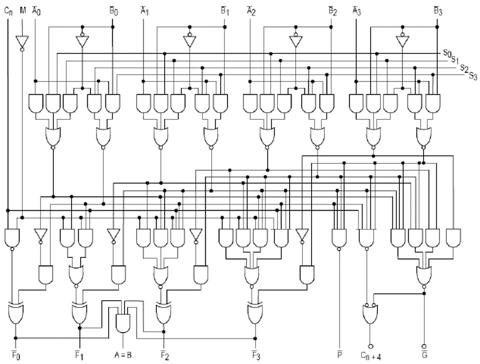

# GB/CPU/算术逻辑单元

ALU(Arithmetic Logic Unit, 算术逻辑单元)是 CPU 对整数进行算术运算和位运算的组合数字电路, 其由一系列的门电路构成. 大部分ALU都可以完成以下运算:

- 整数算术运算(加, 减, 有时还包括乘和除, 不过成本较高)
- 位逻辑运算(与, 或, 非, 异或)
- 移位运算(将一个字向左或向右移位或浮动特定位, 而无符号延伸)

可以发现 ALU 并不处理浮点数, 是因为浮点数运算一般交由 FPU(Floating Point Unit, 浮点运算单元)完成. 在 CPU 发展的早期, FPU 曾是独立 CPU 存在的一个"扩展"硬件, 有点类似今天的 GPU 与 CPU 的关系, 不过随着科技的发展现今许多 CPU 都内置 FPU 了. 额外要提醒的一件事是 ALU 与 FPU 并不是对立的, 因为 FPU 电路通常也有很大一部分由 ALU 电路构成. ALU 承担了 CPU 最核心的计算能力, 它是计算机之所以称为"计算"机的关键. 甚至从某一方面来说, 如果了解了 ALU, 也就了解了什么是计算机.

历史上第一张 ALU 芯片是 74181, 如下图所示, 其于上世纪七十年代发布. 它是计算机史上的一个里程碑, 因为在它之前, 为了让计算机执行不同的应用程序, 通常需要使用者手动调整计算机的逻辑电路, 这让计算机显得不那么通用, 而 74181 通过编程的方式可以在不改变物理电路的前提下让计算机去执行不同的程序.



下图展示了 74181 芯片支持的算术与逻辑运算, 以现代的眼观来看其十分简陋, 比如没有位运算功能.



后续的小节将试图使用最简单的门电路组合来设计一个进行 8 位整数加法运算的 ALU, 让读者可以对 ALU 的工作方式有个初步印象. 正如 ALU 的中文名称"算术逻辑单元"描述的那样, ALU 确实由两部分构成: 算术单元(AU)与逻辑单元(LU).

## 门电路

为了实现和完成一个 ALU, 我们将从最基础的逻辑电路门电路开始. 用以实现基本逻辑运算和复合逻辑运算的单元电路称为门电路. 电路中存在三种基本的逻辑关系: 与逻辑, 或逻辑, 非逻辑. 与此相对应, 基本的门电路有与门, 或门, 非门(反相器)和异或门等. 在电路图(Circuit Diagram)中, 它们可以分别使用下图所示的 ANSI/IEEE Std 91-1984 逻辑符号表示.


**与门**

与门(AND)是数字逻辑电路中实现逻辑与的门电路, 其真值表如下所示. 真值表是一种使用于逻辑中(特别是在连结逻辑代数, 布尔函数和命题逻辑上)的一类数学用表, 用来计算逻辑表示式在每种论证(即每种逻辑变数取值的组合)上的值. 尤其是, 真值表可以用来判断一个命题表示式是否对所有允许的输入值皆为真, 亦即是否为逻辑有效的.

 A  |  B  | A AND B
--- | --- | -------
0   | 0   | 0
0   | 1   | 0
1   | 0   | 0
1   | 1   | 1

仅当输入均为高电压 1 时, 输出才为高电压 1; 若输入中至多有一个高电压时, 则输出为低电压.

**或门**

或门(OR)是数字逻辑中实现逻辑或的逻辑门, 其真值表如下所示. 只要两个输入中至少有一个为高电平 1, 则输出为高电平 1; 若两个输入均为低电平 0, 输出才为低电平 0.

 A  |  B  | A OR B
--- | --- | ------
0   | 0   | 0
0   | 1   | 1
1   | 0   | 1
1   | 1   | 1

**非门**

非门(NOT)是数字逻辑中实现逻辑非的逻辑门, 其真值表如下所示. 它的作用是对输入做一次反相.

 A  | NOT A
--- | -----
0   | 1
1   | 0

**异或门**

异或门(XOR)是数字逻辑中实现逻辑异或的逻辑门. 若两个输入的电平相异, 则输出为高电平1; 若两个输入的电平相同, 则输出为低电平0. 即如果两个输入不同, 则异或门输出高电平1. 其真值表如下所示.

 A  |  B  | A XOR B
--- | --- | -------
0   | 0   | 0
0   | 1   | 1
1   | 0   | 1
1   | 1   | 0

## 半加器

首先从最简单的加法运算, 一位二进制数的加法运算开始. 现在有两个二进制数 A 和 B, 以及 A + B 的 Output 结果, 这三者都是 0 或 1 之间的一个数. 它们之间的组合只有 4 种, 其中前三种情况的真值表如下.

 A  |  B  | Output
--- | --- | ------
0   | 0   | 0
0   | 1   | 1
1   | 0   | 1

可以发现, 在这三种状态下, A 与 B 的真值表与异或门相同. 但是还有另外一种情况, 即 A 与 B 均为 1 时.

 A  |  B  | Output
--- | --- | ------
1   | 1   | ?

很明显 1 + 1 = 2, 但是 2 却已经超过了一位二进制数的表示范围. 因此, 需要引入一个额外的进位标志, Carry Bit. 因此, 最终的 A + B 真值表如下:

 A  |  B  | Carry Bit | Output
--- | --- | --------- | ------
0   | 0   | 0         | 0
0   | 1   | 0         | 1
1   | 0   | 0         | 1
1   | 1   | 1         | 0

仔细观察 Carry Bit 与 A 和 B 之间的关系, 可以发现它们的逻辑关系符合与门. 因此, 只需要在异或门上并联一个与门, 就能制造符合上述真值表的实际电路. 电路图下图所示. 其中输出 S 表示 Sum, 即真值表中的 Output, C 表示 Carry Bit.


这个电路被称为半加器(Half Adder), 它仅仅通过两个门电路便实现了一位二进制数字的加法.

## 全加器

现在将上面的半加器抽象化, 让它成为一个单独的组件并隐藏掉其内部的逻辑门细节, 结果如下图所示.



为了处理真正的整数加法, 需要引入一个新的电路: 全加器(Full Adder). 全加器将两个一位二进制数相加, 并根据接收到的低位进位信号, 输出和与进位输出. 全加器的三个输入信号为两个加数 A, B 和低位进位 Cin. 全加器通常可以通过级联的方式, 构成多位(如 8 位, 16 位, 32 位)二进制数加法器的基本部分. 全加器的输出和半加器类似, 包括向高位的进位信号 Cout 和本位的和信号 S. 一位全加器的真值表为:

 A  |  B  | Cin | Cout |  S
--- | --- | --- | ---- | ---
0   | 0   | 0   | 0    | 0
0   | 0   | 1   | 0    | 1
0   | 1   | 0   | 0    | 1
1   | 0   | 0   | 0    | 1
0   | 1   | 1   | 1    | 0
1   | 1   | 0   | 1    | 0
1   | 1   | 1   | 1    | 1

在实际的应用中, 全加器可以通过不同的方式制造, 例如直接利用晶体管级的电路, 或者由其他现成的逻辑门来构成. 本书介绍一种通过使用两个半加器来构造全加器的方式, 即将输入端 A 和 B 连接到一个半加器上, 然后将其和输出信号与进位输入信号分别作为第二个半加器的两个输入, 并将两个进位输出信号进行逻辑或运算. 电路图下图所示.



再一次, 可以将全加器抽象化, 让它成为一个单独的组件并隐藏掉其内部细节.



## 整数加法

在实现全加器后, 下一步便是实现真正的整数加法. 假设需求要实现两个八位整数相加, 由于它由 8 个位构成, 因此可以先从第一位开始相加, 此时不需要处理任何进位, 因为这是第一个加法, 使用一个半加器就能很好的完成这个任务. 从第二位开始到第八位结束, 由于涉及前一位的进位便需要使用全加器来处理前一个半加器产生的进位标志 Carry Bit. 最终获取八位整数相加的电路图如下所示.



该电路学名叫做"8 位进位加法器". 注意该加法器最后有一个 Carry Bit 输出, 如果该输出位 1, 说明两个数相加的和太大了, 超过了八位整数的表示上限, 在计算机科学上可以使用专用名词"溢出"来表示这种情况. 溢出通常会造成意想不到或令人啼笑皆非的 Bug, 比如在 FC 游戏《超级马里奥兄弟》就一直流传着这样一个传说: 除普通流程的游戏关卡外, 还隐藏着"水下八关", 在这些隐藏关卡中, 玩家能看到鱼在天上飞, 云跑到水面下等奇观. 一些考据党确实通过一系列的复杂操作通过卡 Bug 的方式进了这水下八关. 水下八关的由来就是数值溢出造成的 Bug. 另外有《梅德希尔的文明》系列游戏中的梗: 印度领袖"核平"使者甘地, 因为在正常游戏流程中, 甘地拥有极低的侵略值(表示主动对游戏世界内其它国家发起侵略的概率), 但当游戏进入到后期, 通过发展一些特殊科技可以进一步降低甘地的侵略值, 此时减法操作溢出, 甘地的侵略值从 0 变为正的 255, 于是就能在游戏中看到甘地疯狂扔核弹的奇观. 当然, 这个 Bug 在后续版本的游戏中已经被修复.

在许多廉价的 ALU 芯片中通常不存在专门的乘法电路, 因为乘法可以用加法替代, 虽然速度慢, 但结果正确. 这种替代广泛应用在像微波炉, 冰箱等家电上. 事实上实现乘法并不需要多复杂的操作, 只是需要更多的门电路而已, 这些廉价芯片为了极限压缩成本而选择不去实现专门的乘法电路(当然在微波炉等家用电器上也用不到太复杂的乘法运算, 因此一些性能损失是可以接受的).

## 逻辑运算

ALU 除了做算术运算外, 还可以做逻辑运算. 以一个与门举例, 它可以进行两个一位二进制数的与操作. 但这和编程语言中常用的与操作还是有些差距的. 在代码中的与操作其输入通常是一个 N 位整数, 如下代码所示:

```rs
fn main() {
    let a: u8 = 0x0f; // 0b00001111
    let b: u8 = 0xf0; // 0b11110000
    let c = a & b;    // 0b00000000
    println!("{:?}", c);
}
```

上述代码所演示的与操作其两个输入均是八位无符号整数, 其输出也是八位无符号整数. 也就是说, 它需要同时对 8 个一位二进制数进行与操作, 并得到 8 个一位二进制数结果. 那么该如何使用与门来完成呢? 其实也很简单, 可以构造电路图如下.



将 8 位输入分别连接到 8 个与门上, 可以标记为 A0, A1, ... ,A7, 代表第一个操作数. 第二个操作数进行同样的操作, 标记为 B0, B1, ... ,B7. 这 8 个与门的输出, 分别记为 Y0, Y1, ... , Y7, 它们可以组成了一个 8 位整数, 这样就完成了整数的与操作. 与之类似的, 如果要完成整数的或操作, 只需要将与门替换为或门.


在现实世界中, ALU 通常不会只完成一个功能, 比如并没有专门用于与运算的 ALU. 取而代之的是, 会有一个既可以完成与运算又能完成或运算等多种功能的 ALU. 当 ALU 获得输入时, 它会同时将输入 A 和 B 传入到所有电路(与操作电路, 或操作电路等), 并在同一时间获得 A AND B,  A OR B 等的全部结果. 最后为了取得需要的计算结果和抛弃不需要的计算结果, 所有的输出结果会再经过一个选择器做最终选择. 选择器也是由门电路构成的, 这里不做过度展开, 感兴趣的读者可以自行查找相关资料进行学习.

在本节的最后, 我们再回到开头提到的 74181 芯片. 74181 芯片的组合逻辑电路大约只使用了 70 个门电路, 其电路图如下所示:



如果读者对此感到兴趣, 甚至可以购买材料后依照电路图自己动手组装一张 74181 芯片出来(虽然 74181 芯片已经是半个世纪前的产物, 但设计和制作一张芯片的原理通用, 且并不困难).

不过对于 Game Boy 所使用的 LR35902 CPU 来说, ALU 要比上面介绍的稍微复杂一点. 比如在对整数进行运算时, 除了进位标志 Carry Bit 外, 还会包含 Zero Bit 用于判断 Output 是否为 0, Half-Carry Bit 判断两个操作数的第 3 位是否发生了进位等. 它们的基本原理是相通的, 在后面的内容中会再深入探讨. 但眼前必须解决一个更重要且紧急的问题:要交给 ALU 操作的 A 和 B 这两个操作数数据是从哪儿来的?
