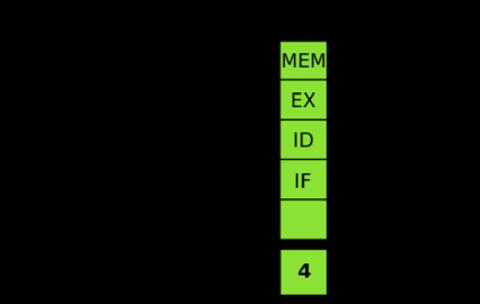

# GB/CPU/流水线

本节将讨论 CPU 设计中的一个知识: 流水线. 它和本书要实现的 Game Boy 仿真器并没有太大关系, 读者完全可以将本节作为一个扩展阅读. 但是了解流水线容易帮助读者更好的去实现 CPU 仿真器.

## 流水线的概念

流水线的概念最早起源于工厂, 假设某地有个汽车生产工厂, 生成一辆成品车的生产过程分为底盘生产, 车轮生产和最后组装三个步骤. 每个底盘需要消耗一个工人 10 秒, 车轮需要消耗工人 20 秒, 组装需要消耗工人 15 秒. 因此生产一辆完整的汽车, 总共需要消耗 45 秒时间. 但这种生产模型下有一个问题, 就是当生产车轮时, 第一个生产底盘的工人是闲置的. 这时候, 可以让第一个工人生产完第一辆车的底盘后, 立即投入去生产第二辆车的底盘, 这样下来平均一辆车只需要花费 3 个工人中最耗时的那个工人, 也就是 20 秒时间.

处理器中也有个经典的 5 级流水线模型, 它来自 MIPS(MIPS architecture, MIPS 架构), 在此流水线模型下一条指令的生命周期有如下过程:

0. 取指. 取指(Instruction Fetch)是指把指令从存储器中读取出来的过程.
0. 译码. 译码(Instruction Decode)是指将指令进行翻译的过程. 经过该步骤后, 指令需要读取哪些寄存器以及这些寄存器中的值将被取出.
0. 执行. 执行(Instruction Execute)使用的主要的部件就是 ALU(算术逻辑部件运算器), 是指对指令真正进行运算的过程. CPU 中绝大部分的计算操作都是在这里面完成的. 常见的操作比如进行数字的加减乘除等.
0. 访问. 访问(Memory Access)是指读取/写入数据到内存中的过程.
0. 回写. 回写(Write Back)是指将运算结果写回寄存器的过程. 该值可以是执行阶段的结果, 也可以是访问阶段的结果, 具体取决于指令类型.

在 CPU 设计中, 可以采用类似工厂中的流水线方式以提高性能. 当第一条指令从取指阶段进入译码阶段后, 取指模块将立即进行第二条指令的取指操作, 并依次类推, 理论上每一条指令的执行周期等于 5 级流水线中耗时最长的一级的执行周期. 示意图如下所示(IF: 读取指令, ID: 指令解码, EX: 运行, MEM: 存储器访问, WB: 写回寄存器).

并非所有处理器都是流水线化的, 一些早期处理器就未使用流水线设计. 但这些未流水线化的架构运行效率很低, 因为有些处理器的模块在其他模块运行时是闲置的. 流水线虽并不会完全消除 CPU 的闲置时间, 但是能够让这些模块并发运作而大幅提升程序运行的效率. 流水线的其中一个级越简单, 则处理它的频率就可以越高. 现代的中央处理器中一个指令流水线可以长于 30 级. 通常来讲, 在一定范围内, 流水线级别越多, 单个指令的运行速度越慢, 但 CPU 整体吞吐量却越高, 因为同一时间可以处理更多指令.

但凡事都有反例, 比如 Intel 的 Pentium 4(奔腾 4)系列处理器, 其设计的流水线由于过长(总共 31 级的流水线), 虽然获得了在那个年代极高的主频, 但综合性能却完全跟不上, 落得个高频低能的臭名. 当时 AMD 主打的是 K8 处理器, 这也是历史上唯一一段时间 AMD CPU 性能完全超过 Intel CPU 的时代, 不过这段辉煌的历史马上就因为 Intel 的酷睿系列(Intel Core)处理器的出现而终结了.

## 风险

风险(hazard)是指在计算机 CPU 的微体系结构中, 指令流水线乱序执行中的一些问题可能会导致得到不正确的计算结果. 一个指令在执行的时候, 如果需要等待流水线上前一个指令先执行完毕的话, 那么这两个指令相互之间彼此有依赖关系. 有 3 类典型的风险:

- 资源冲突: 流水线上的一个指令需要使用已经被另一个指令占据的资源.
- 数据冲突.
    - 指令层的数据冲突: 指令需要的数据还没有计算出来
    - 传输层的数据冲突: 指令需要的数据还没有被存入寄存器
- 控制流冲突: 流水线必须等待一个有条件的跳转指令是否会被执行.

这些冲突导致相对应的指令, 必须在流水线的开始处等候, 这会在流水线上导致空缺. 这样的话流水线就不能顺利运行, 处理速度便开始下降. 因此要尽量避免这样的冲突, 可以使用下面的方法来避免冲突:

- 通过增加功能单位可以解决资源冲突. 通过把流水线后面的计算结果立刻向前传可以避免许多数据冲突.
- 通过分支预测器可以避免控制冲突. 在这里处理器预测性地继续运算, 直到正式预测是正确为止. 假如预测错误的话那么在其中已经执行的指令要被推翻. 尤其流水线非常长的处理器在这种情况下要浪费许多时间. 因此这些处理器拥有非常高级的分支预测技术, 只有百分之一的分支预测会发生错误, 其流水线需要清除.

长流水线的优点在于它能够大大地提高处理器速度, 但缺点在于许多指令被同时执行, 假如分支预测错误的话整个流水线上所有的指令全部要被取消, 流水线要被重新充满. 这需要从存储器或者中央处理器缓存中调用指令, 导致延迟时间, 在这段时间里处理器没有工作.

在仿真器开发领域, 对一枚流水线模型的处理器进行仿真器实现的时候, 会有两种实现方式:

- 单指令线性执行
- 多指令并行执行

第二种方式完全遵守硬件规范, 但缺点在于开发者必须自己实现分支预测和风险处理, 如果希望更加贴近硬件实现的话, 可能还需要实现缓存模拟等各种功能, 从代码量和复杂度上来说会比第一种高不少. 同时, 第二种实现方式一般不会用在实际项目上, 其更多用于教学或测试目的. 总的而言, 本书将采取相对简单且性能更好的单指令线性执行方式.

自此关于 CPU 的前置知识讲述完毕, 是时候向 LR35902 芯片发起真正的挑战了!
