# GB/虚拟机发展史/硬件仿真器

通常来讲, 得益于 CPU 性能的提高与互联网使知识传递变得便捷, 硬件仿真器在 1995 到 1997 年间变得流行起来. 很多时候在讨论图灵机的时候, 容易遗忘一个要点, 那就是计算机 P 与计算机 Q 图灵等价的前提是: 它们均拥有近乎无限的存储与无限的计算能力(想象一下, 绝对无法在只有 128 Byte 内存的 51 单片机上运行模拟一台 Windows 系统的电脑). 因为硬件技术发展而推动软件巨大进步的例子还有许多, 比如深度学习在 2014 年左右的爆炸式提升其最大推手是 NVIDIA 推出的高性能 GPU, 这使得许多理论上可行却受限于计算力限制的方案得以真正在现实中测试和运行.

## 硬件仿真器

"硬件仿真器"是虚拟机的一个子类, 在后面的小节中, 会逐渐了解到"虚拟机"其实是多门不同的计算机科学技术的总称. 为了避免歧义, 本书使用硬件仿真器来指代一种在通用计算机平台上模拟领域专用物理元器件的模拟程序. 该模拟程序可以分别模拟原始机器中央处理器, 图形处理器, 声卡, 存储器, 输入输出设等设备. 仿真器多用于电视游戏和街机, 也有一些用于微机或掌上电脑. 同时仿真器一般需要 ROM 才能执行, ROM 的最初来源是一些原平台的 ROM 芯片, 通过一些技术手段将源程序拷贝下来(这个过程一般称之为 Dump), 然后利用仿真器加载这些 ROM 来实现仿真过程.

在硬件仿真器技术发展的早期, Hacker 们喜欢将任天堂的游戏机作为研究对象, 当时比较先进的仿真器能较为完整地模拟红白机(Nintendo Entertainment System, NES), 超级任天堂(Super Nintendo Entertainment System, SNES)与 Game Boy. 这个时期"索尼克之父"中裕司(Yuji Naka)也为 Mega Drive 设计了红白机仿真器, 虽然该仿真器没有发布, 但这可能是首个在一个游戏机上模拟另一个游戏机的仿真器.

## NES

NES(也因为其红白相间的配色被戏称为红白机)是由任天堂开发和制造的 8 位家用视频游戏机, 最初发行于 1983 年 7 月 15 日的日本. 由于它是任天堂首次进军游戏娱乐市场, 因此它被任天堂亲切的称为"Nintendo Entertainment System"或"任天堂娱乐系统". 该游戏机确立了任天堂在游戏机市场一哥的地位. 由于该平台与该平台上的游戏是如此的成功, 一些 Hacker 迫不及待的试图通过硬件仿真器的方式将它们带给其他平台的玩家. 其中最早发售于 NES 的 *Super Mario Bros*(中译名超级玛利欧兄弟)是现如今世界上最吸金的虚拟游戏人物.

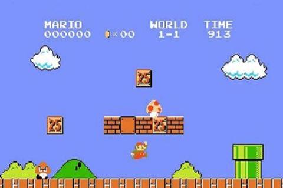

NES 仿真器的早期历史比较模糊, 但有一些比较著名的仿真器.

- 1990 年 12 月, 运行在 FM Towns 个人计算机(日本公司富士通生产的一种个人电脑)上的 Family Computer Emulator V0.35 发布, 作者是 Haruhisa Udagawa, 据称他从 1980 年开始就一直在 Namco(南宫梦)工作. 它可以运行一些简单的 NES 游戏, 比如大金刚.
- 运行在 FM Towns 个人计算机上的 Pasofami, 拥有非常初步的声音仿真, 于 1993 年发布.
- 由 Alex Krasivsky 发布的 LandyNES, 能较为完美的模拟 NES 游戏机. 很不幸的是, 其源码与发布的二进制文件均已在互联网上遗失.
- 1997 年, 来自 Sonic(索尼)头部开发团队的 Yuji naka 发布了运行在 Mega Drive 上的 NES 仿真器.
- NESA(Nintendo Entertainment System in Assembler)是世界上第一个开源且免费的 NES 仿真器.

当时间来到 21 世纪后, NES 仿真器的理论与实践已经非常成熟. 许多计算机爱好者开始以学习为目的开发和研究 NES 仿真器, 并且这项运动一直持续到现在还没有停止. 在 Github 上以"NES Emulator"为关键词能找到大量不同语言和操作平台的开源实现, 这极大的方便了当今的仿真器开发者.

## Game Boy / Game Boy Color

Game Boy 是任天堂公司在 1989 年发售的第一代便携式掌上游戏机. Game Boy 拥有三个改版机型, 分别是小尺寸的 Game Boy Pocket, 加入背光功能的 Game Boy Light, 以及彩色的 Game Boy Color. 截止 2003 年 3 月 23 日停产后, Game Boy 的全系列机种合计在全球累计销量为 1 亿 1869 万台, 为目前世界上累计销量第 2 位的掌上型游戏机.

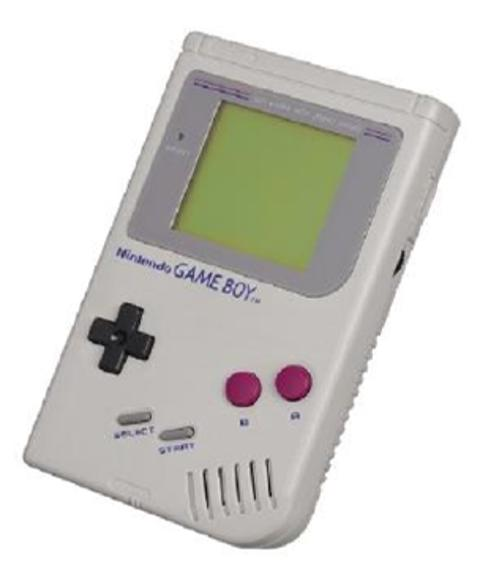

Game Boy 的发售仅晚于 NES 6 年, 但它在性能, 画面质量, 声音, 游戏内容和便携性上均远远优于 NES. 能取得如此大的突破主要归功于硬件的发展和理论的突破. 有关于 Game Boy 的更多技术细节, 在本书后续会陆续介绍.

考据历史是非常有趣的一件事. 在 1995 年之前, 对 GB/GBC 的仿真知之甚少. 有可靠记录的第一个 Game Boy 仿真器是 Marat Fayzullin 的 Virtual GameBoy(VGB), 它是第一个可以运行商业游戏的 GB/GBC 仿真器, 在 1995 年首次发布, 然后在 1995 年或 1996 年的某个时间被移植到 PC, 并在 1998 年增加了 Game Boy Color 支持.

Game Boy 大概在 90 年代中后期进入中国内地, 相信许多读者都有过相关的游戏的记忆. 但有一个有趣的事实是, 绝大部分游戏"八国语言"支持列表中都没有中文, 但在那个时候却确实能玩到大量中文游戏. 这其实得益于几家盗版卡带的制造商: 他们为了好贩卖盗版卡带, 而对卡带内的游戏做了汉化(当然汉化质量是不敢恭维的, 比如有名的意识流汉化作品《精灵宝可梦》). Game Boy 仿真器在这些盗版卡带公司汉化的过程中承担了巨大的作用: 当年的游戏开发中, 图片, 声音, 文字是与游戏的逻辑代码编译到一起的, 因此汉化过程必须准确找出需要汉化的文字, 而不去修改逻辑代码. 这样当每次对游戏的 ROM 做出一点修改, 就可以在仿真器上立即验证翻译结果而不用真的去烧录一个实体卡带.

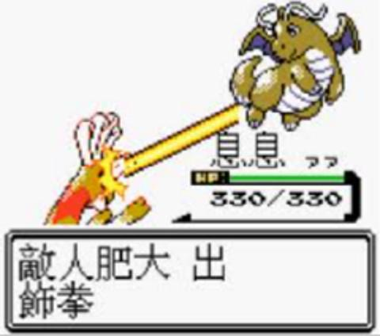

八国语言是指英, 法, 德, 俄, 美, 日, 意和奥八个国家的语言. 任天堂早期游戏只支持这八个国家的语言, 原因是"为发售其他国家的语言版本的销量无法支撑庞大的翻译和本土化成本". 直到 2017 年任天堂推送的 Switch 的 4.0.0 的系统升级中第一次正式出现了简体中文的选项, 之后更是一口气公布了包括《异度神剑》, 《赛尔达传说: 旷野之息》和《超级马里奥: 奥德赛》在内等十几款游戏的中文版. 在国内玩家购买力越来越高的今天, 相信未来会出现更多带"官方汉化"的游戏.

现在许多耳熟能详的 IP 最初都诞生在 Game Boy, 回想起来, 那真是一个充满传奇的时代啊!

## PlayStation

PlayStation(官方缩写为 PS, 通常被称为 PS1 或其代号 PSX)是由索尼电脑娱乐开发和发售的家用游戏机. 主机于 1994 年 12 月 3 日在日本发布, 1995 年 9 月 9 日在北美发售, 1995 年 9 月 29 日在欧洲发售, 1995 年 11 月 15 日在澳大利亚发售. 这款游戏机是 PlayStation 系列家用视频游戏机的第一款, 同时它也是第一个使用 CD 存储游戏数据的游戏机.

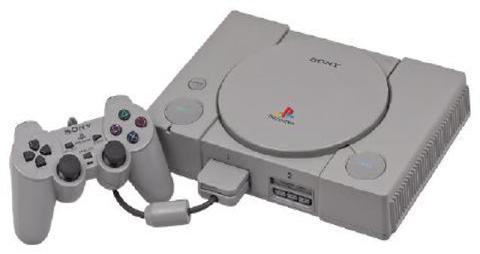

PlayStation 的原型技术最早可以追溯到 1986 年, 最初由任天堂和索尼合资推动. 当时任天堂已经开发出使用软盘存储游戏 ROM 的技术, 但其希望能在存储方式上取得进一步突破, 因此任天堂开始接触索尼, 并共同开发了一个 CD-ROM 插件, 暂定名为 Play Station 或 SNES-CD.

PS 系统上最为著名的游戏当属《最终幻想Ⅶ》，其原定于任天堂 N64 平台发售, 但由于业界变故开发商史克威尔于 1996 年 1 月宣布此作改发售于 PlayStation. 该作取得了巨大的成功, 同时在 2005 年推出了具有划时代意义的全 CG 电影《最终幻想Ⅶ: 圣子降临》.

PlayStation 仿真器的历史可以追溯到 1998 年. PSEmu/PSEmu Pro 是最早可以运行商业游戏的 PS 仿真器之一, 另一个比较有名的仿真器 Psyke 于 1998-1999 左右发布, 是第一个使用动态重新编译(Dynamic Recompilation)来加速仿真的 PS 仿真器.

## PlayStation 2

PlayStation 2(PS2)是索尼电脑娱乐公司开发和销售的家用视频游戏机. 它于 2000 年 3 月 4 日在日本首次发布, 于 2000 年 10 月 26 日在北美, 2000 年 11 月在欧洲和澳大利亚发布, 它是原版 PlayStation 的继承者, 也是 PlayStation 游戏机阵容的第二世代. 至目前为止, 它被广泛的认为是最具代表性的最佳游戏主机. 作为原版的继承者, PS2 可以向上兼容 PS1 的游戏.

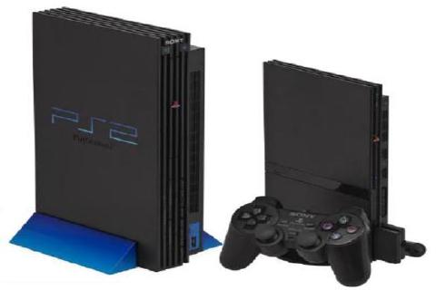

由于 PS2 加入了 GPU, 并采用 3D 影院声音系统, 因此它对承载仿真器运行的机器配置要求较高. 其中最为著名的仿真器是 PCSX2, 于 2001 年中期开始, 并于 2002 年 3 月 23 日首次发布. 笔者大概在 2010 年左右曾下载过该仿真器, 但即使以 2010 年的笔记本电脑配置也依然无法流畅运行大部分 3D 游戏. 另一个仿真器 PS2Emu 在 2001 年的某个时候开始开发, 但直到 2004 年 5 月 6 日才发布了第一个也是唯一一个版本.

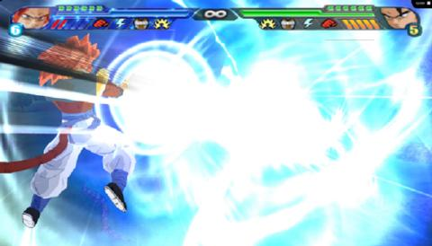

## Game Boy Advance

Game Boy Advance(简称 GBA)是任天堂公司于 2001 年 3 月 21 日发售的便携式游戏机, 最大特点是采用了彩色的 TFT 液晶屏幕, 可向下兼容上一代的的 Game Boy 和 Game Boy Color 的游戏. 它是历史悠久的经典之作, 很快就成为热门, 就像它的"父亲"Game Boy 一样.

GBA 拥有两个独立的处理器, 其中一个是 Game Boy 的处理器, 用于兼容老游戏, 另一个是使用了 RISC(Reduced instruction set computing, 精简指令集计算, 是计算机 CPU 的一种设计模式)指令集的新处理器 ARM7TDMI.

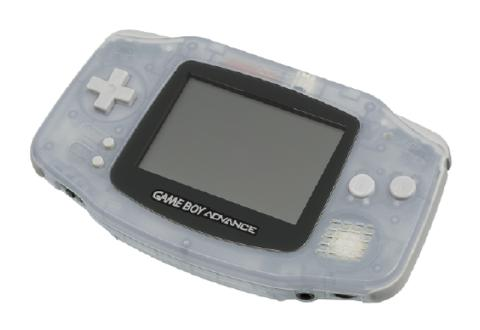

GBA 仿真器的历史特别有趣, 它早在 2000 年就已经被模拟, 这离它发售还有一年时间. 具体原因, 除却一些都市传说, 可能和下面这些因素有关:

1.	GBA 所使用的 ARM7TDMI CPU 发售于 1999 年, 且有公开的技术资料.
2.	除了使用一颗新的 CPU 外, GBA 与 GB 在仿真上的难度差别不大.

Game Boy Advance 也有一些非常著名的仿真器, 这些仿真器以及他们所仿真的游戏陪伴笔者度过了艰难的青少年时期.

- GBAEmu, 发布于 2000, 是已知的第一个 GBA 仿真器. 它已经可以运行任天堂公开的 Demo: "Yoshi's Story".
- Virtual GameBoy Advance(VGBA), 同样发布于 2000 年, 作者 Marat Fayzullin 是一个老牌的仿真器专家. 在此之前他已经先后制作了 NES 与 Game Boy 仿真器. 该仿真器最为被国内玩家熟知, 因为它拥有汉化版, 并且在盗版盛行的年代, 经常被盗版网站作为绑定的游戏运行器. 该仿真器现已经开源, 其由 C++ 编写而成, 项目代码质量属于顶尖级别. 在 Windows 10 上运行的 Virtual GameBoy Advance 运行截图下图所示, 其正在运行一款名为*Boxes*的游戏.

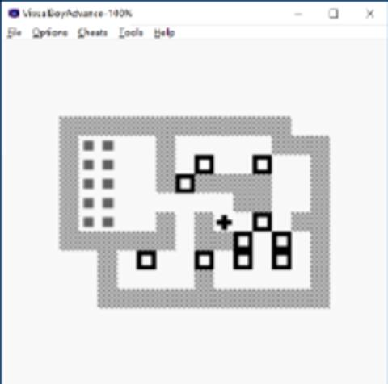

GBA 仿真器是一个历史上的转折点, 此时经过众多仿真器的长时间洗礼, 领域内头部开发者的仿真器开发技术已经相当成熟, 因此甚至能看到游戏机还没造好, 仿真器已经发布的滑稽历史. 但也正因为如此, 不甘被盗版/仿真器损害商业利益的游戏公司开始采取更加严格的加密与反盗版措施, 仿真器的开发变得越来越困难.

## PSP

PlayStation Portable(PSP)是由索尼计算机娱乐开发的第七世代掌上游戏机, 与任天堂开发的第七世代掌上游戏机任天堂 DS 竞争. E3 2003 上索尼公布它们正在开发一款掌上游戏机, 并在 2004 年 5 月 11 日下一届 E3 之前的索尼新闻发布会上公布具体详情.

PlayStation Portable 于 2004 年 12 月 12 日在日本发布; 2005 年 3 月 24 日在北美发布; 并于 2005 年 9 月 1 日在其它使用 PAL 制式的地区发布.

PSP Player 是第一个 PSP 仿真器, 于 2006 年 7 月 4 日开始开发, 并在 2008 年 3 月 6 日首次成功运行 PSP 游戏. JPCSP 于 2008 年 7 月 17 日开始开发, 并在同年成功运行第一个游戏. 它们的后续者 PPSSPP, 直到 2012 年 11 月 1 日才发布第一个版本.

如果谈起 PSP 的历史, 一定离不开一款游戏:《怪物猎人》. 这是一款以一己之力延长 PSP 退休年龄的作品. 围绕怪物猎人有许多有趣的小内容, 比如笔者在互联网上找到了一位为了玩怪物猎人而寻求 PSP 仿真器的玩:

## Xbox 360

Xbox 360 是美国的计算机软件公司微软所发行的第二部家用游戏主机, 为 Xbox 的后继机种. Xbox 360 为索尼计算机娱乐 PlayStation 3 和任天堂 Wii 的市场竞争者, 同为第七世代游戏主机. Xbox 360 最早于 2005 年 5 月 12 日, 在 E3 游戏展前一星期首度曝光, 2005 年 11 月 22 日在北美地区上市, 其后扩展至欧洲及日本地区, 而香港及台湾也已经于 2006 年 3 月 16 日正式上市.

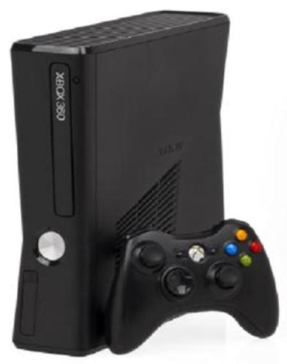

目前已知的 Xbox 360 仿真器只有 Xenia, 它于 2013 年 1 月 11 日开始开发, 并在 2014 年 3 月 24 日发布首个版本. Xbox 360 仿真器在仿真器历史上也是一个分水岭, 因为从它开始绝大部分游戏机仿真器很难再在家用电脑上全速运行游戏. 因为游戏体验的下降, 玩家也很少再试图通过仿真器去玩某一款游戏, 这直接导致了仿真器开发领域的热度下降.

## PlayStation 4

PlayStation 4 是索尼互动娱乐推出的家用电子游戏机, 首发在 2013 年 11 月 15 日于北美开始贩售. 本机作为是本世代(截止自 2020 年)的最新机型.

Orbital 是第一个发布的 PS4 仿真器, 它于 2017 年 10 月 28 日首次发布. 由于仿真器的低级特性, 它需要在能够启动游戏之前运行 PS4 的操作系统. PS4 使用的操作系统是 Orbis OS, 它基于 FreeBSD 开发. 要注意的是 FreeBSD 既可以作为服务器操作系统, 也可以作为家用电脑的操作系统, 其本质比较类似 MacOS. 另一个仿真器 Spine 在 2019 年 6 月 5 日成功运行了两个简单的商业游戏(这件事仅仅发生在笔者写下这段话之前的一月), 运行截图如下所示.

## Nintendo Switch

任天堂 Switch 是日本任天堂公司出品的电子游戏机, 于 2017 年 3 月 3 日在日本, 北美, 欧洲和香港发售, 同年 12 月 1 日在韩国和台湾发售. 拥有可拆卸控制器和可分离式主机. 游戏载体使用了专用卡带, 主机处理器使用了英伟达(NVIDIA)定制的 Tegra X1 系统芯片, 这是任天堂首次采用英伟达的系统芯片.

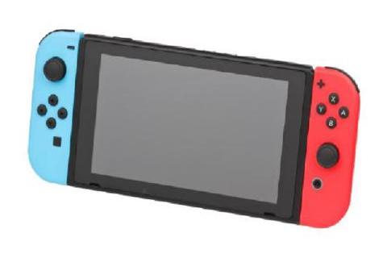

CageTheUnicorn, 现在改名为 Mephisto, 是第一个试图模拟 Nintendo Switch 的程序, 它于 2017 年 5 月 16 日开始开发. 开发人员已经表明他们的目标是将其用作调试器, 并且没有计划让商业游戏运行. 另一款 Ryujinx 仿真器是目前唯一的可正常运行商业游戏的 Switch 仿真器, 运行截图如下所示.

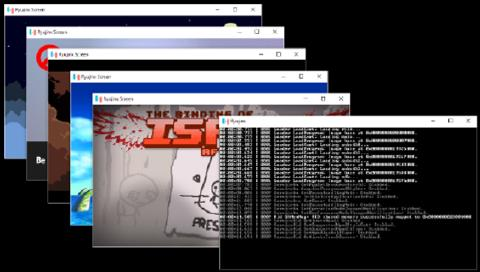
