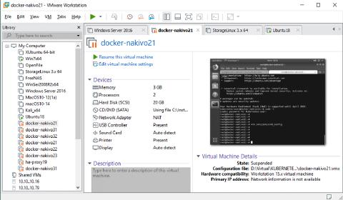

# GB/虚拟机发展史/软件模拟器

软件模拟器的主要作用是运行目标平台的某个或多个应用软件, 在绝大部分情况下不需要模拟出目标平台的所有硬件. 许多人常常错误的将仿真器称为模拟器, 或者将模拟器称为仿真器, 但这两个名词之间是有本质上的区别的. 模拟器最大的特点就是, 代码中没有一行被用作"寄存器级或时钟级的建模", 而主要焦点都放在, 在架构相同的硬件中, 如何在当前的 A 操作系统中, 模拟另一个 B 操作系统运行时的环境. 以一个实际的例子来说, 模拟器可以在 x86 架构下的 Windows 操作系统模拟运行 x86 架构下的 Linux 操作系统, 但它无法运行其它架构下的操作系统.

Virtual Box 和 VMware 是这个领域当仁不让的两大王者. 这种软件可以归类为:"异构"+"同构指令集"的环境. 从性能上来说, 由于使用的相同 CPU 指令集, 软件模拟器性能远远比硬件仿真器来的好, 通常情况下性能损失在 20% 之内. 但是, 这种类别的软件模拟器通常无法有效率的嵌套使用, 比如在 Virtual Box 中再开一个 Virtual Box.

## Virtual Box

Virtual Box 是用于虚拟化 x86 计算体系结构的开源软件. 它充当管理程序, 创建一个 VM, 用户可以在其中运行另一个 OS(操作系统). 运行 VirtualBox 的操作系统被称为 Host OS, VM 中运行的操作系统被称为 Guest 操作系统. VirtualBox 支持 Windows, Linux 或 macOS 作为其 Host OS.

在配置虚拟机时,用户可以指定将多少 CPU 内核以及多少 RAM 和软盘空间分配给 VM.当 VM 运行时,它可以被随时"暂停"(系统执行在该时刻被冻结),并在以后用户希望继续使用它时恢复.

VirtualBox 最初是由德国 Weinstadt 的 Innotek GmbH 根据专有软件许可提供的, 该产品的其中一个版本可以免费获得, 在 VirtualBox 个人使用和评估许可(PUEL)的约束条件下, 可供个人或评估使用. 2007 年 1 月, Innotek GmbH 根据 GNU 通用公共许可证(GPL)的要求, 发布了VirtualBox 开放源代码版(OSE)作为免费和开源软件. Sun Microsystems 于 2008 年 2 月收购了 Innotek. 甲骨文公司于 2010 年 1 月收购了 Sun, 并将该产品更名为 Oracle VM VirtualBox.

## VMWare

VMware 是戴尔科技(戴尔电脑母公司)旗下软件公司, 提供云计算和硬件虚拟化的软件和服务, 并号称是第一个成功商业化的虚拟化 x86 架构.

传统的操作系统虚拟机, 如 Bochs, 透过调用宿主机上的软件子程序逐条运行每一道客户机的 CPU 指令, 以此模拟客户机的微处理器. 这种抽象化的方法, 可使宿主机模拟出不同于自身微处理器的环境, 让客户机运行. 然而这类虚拟机运行得非常慢(其实质是仿真器).
一种更有效率的方式是在初次执行客户机指令时动态地重新编译那些机器指令块, 以后用到这些指令时直接执行经过翻译的代码. 这种方式是由微软的 Virtual PC for Mac OS X产品, 以及 Fabrice Bellard 的 QEMU 产品(不含 KVM 附加模块)所使用的方式.

和 Virtual PC for Windows 产品及带有 kqemu 附加模块的 QEMU 产品一样, VMware 使用了一种更加优化的方式, 在尽可能的情况下直接运行程序代码. 当不能直接运行程序代码时, 这几种软件产品会动态地重写代码(内核级别). 在 VMware 中, 经过翻译的代码直接被放入内存的空闲区域中的, 并且这个区域通常被设置为外部不可见的. 由于这些原因, VMware 能以超过在真实硬件上运行速度的 80% 的速度运行虚拟的客户操作系统.
