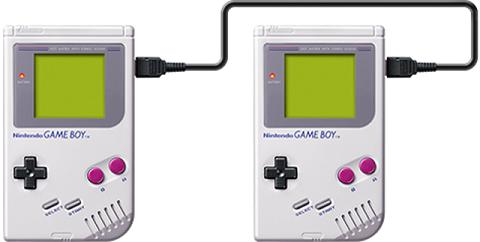

# GB/其它/串行通行接口

早在 Game Boy 设计的初期, 支持多人游戏就已经是它重要的设计目标. 任天堂上一代的 FC 游戏机由于以电视机为显示器, 同时它的机器上拥有多个手柄接口, 因此可以非常简单的实现多人同屏游戏. Game Boy 由于是一个掌机, 必须采用另一种方式来实现多人游戏.



早期 Game Boy 机型采用一条连接线来连接两台不同的游戏机. 但这条连接线也可以连接其他 Game Boy 支持的硬件设备, 比如 Game Boy 相机或 Game Boy 打印机. 连接线是启发精灵宝可梦系列的创作者田尻智的一项重要元素之一, 在他的访谈中曾提到因为他构思出生物经由缆线从一台游戏机跑到另一台游戏机的情景, 于是便成为了之后游戏中的交换功能. 连接线是《宝可梦》系列最早也是第一世代唯一能交换宝可梦及对战的方法, 随著无线通讯科技的进步, 连接线的功能在第四世代起便被完全取代.

当两个 Game Boy 通过连接线硬件连接时, 专门的通信硬件: 串行接口, 允许两个 Game Boy 之间一次通信一个字节. 一个 Game Boy 充当主机, 使用其内部时钟, 从而控制何时进行数据交换. 另一个使用外部时钟(即另一个 Game Boy 的内部时钟), 且无法控制何时进行传输. 它们之间采用串行通行, 如果在传输开始时还没有加载下一个数据字节, 则后一个将消失. 或者, 如果准备发送下一个字节时却发现上一个还未发送出去, 则别无选择, 只能等待.

Game Boy 的串行接口实现并不在本书预定的内容之中. 因为要实现这种数据交换, 将势必要引入进程间通信. 本节将介绍串行通信接口的规范, 并忽略所有串行通信请求. 串行通信接口的寄存器如下所示.

## FF01 SB: Serial transfer data

- 在传输之前, 它将保存将要发送的下一个字节.
- 在传输过程中, 它混合了输出字节和输入字节. 在每个传输周期中, 最左边的位移出(并通过连接线传送出去), 而传入的位从另一侧移入.

## FF02 SC: Serial Transfer Control

|  位   |                             说明                             |
| ----- | ------------------------------------------------------------ |
| Bit 7 | 传输开始标志(0=正在进行或未请求传输, 1=正在进行或已请求传输) |
| Bit 1 | 时钟速度(0=正常, 1=快速), 仅 CGB 模式                        |
| Bit 0 | 移位时钟(0=外部时钟, 1=内部时钟)                             |

充当主机的 Game Boy 将在 SB 寄存器中加载数据字节, 然后将 SC 寄存器设置为 0x81(请求传输, 使用内部时钟). 将会以两种方式通知游戏传输已完成: 清除 SC 寄存器的第 7 位(即, 将 SC 寄存器设置为 0x01); 调用串行中断处理程序(即, CPU 将跳至 0x0058).

另一个 Game Boy 将加载一个数据字节, 并可以选择设置 SC 寄存器的第 7 位(即SC = 0x80). 无论是否执行此操作, 如果主机游戏玩家执行传输, 数据传输过程都会发生. 被动接收数据的 Game Boy 将在传输结束时调用其串行中断处理程序, 如果它设置了 SC 寄存器的第 7 位, 则将其清除.

## 内部时钟

在非 CGB 模式下, Game Boy 仅提供 8192Hz 的内部时钟(每秒传输大约 1KB). 在 CGB 模式下, 根据 SC 寄存器的第 1 位以及是否使用 CGB 倍速模式, 可以使用四个内部时钟速率:

```text
  8192Hz -  1KB/s - Bit 1 cleared, Normal
 16384Hz -  2KB/s - Bit 1 cleared, Double Speed Mode
262144Hz - 32KB/s - Bit 1 set,     Normal
524288Hz - 64KB/s - Bit 1 set,     Double Speed Mode
```

## 外部时钟

外部时钟通常由另一个 Game Boy 提供, 但也有可能由另一台计算机提供(例如, 将 Game Boy 连接到 PC 的并行端口), 在这种情况下, 外部时钟可以具有任何速度.

使用外部时钟时, 直到接收到最后一位, 传输才算完成. 但是如果另一个 Game Boy 不提供时钟信号, 或者它被关闭, 或者根本没有连接上另一个 Game Boy, 则传输将永远不会完成. 因此, 传输过程应使用超时计数器, 如果在超时间隔内未收到响应, 则中止通信.

## 代码实现

```rs
// Communication between two Gameboys happens one byte at a time. One Gameboy acts as the master, uses its internal
// clock, and thus controls when the exchange happens. The other one uses an external clock (i.e., the one inside the
// other Gameboy) and has no control over when the transfer happens. If it hasn't gotten around to loading up the next
// data byte at the time the transfer begins, the last one will go out again. Alternately, if it's ready to send the
// next byte but the last one hasn't gone out yet, it has no choice but to wait.
//
// See: http://gbdev.gg8.se/wiki/articles/Serial_Data_Transfer_(Link_Cable)
use super::intf::Intf;
use std::cell::RefCell;
use std::rc::Rc;

pub struct Serial {
    _intf: Rc<RefCell<Intf>>,

    // Before a transfer, it holds the next byte that will go out.
    // During a transfer, it has a blend of the outgoing and incoming bytes. Each cycle, the leftmost bit is shifted
    // out (and over the wire) and the incoming bit is shifted in from the other side:
    data: u8,
    // Bit 7 - Transfer Start Flag (0=No transfer is in progress or requested, 1=Transfer in progress, or requested)
    // Bit 1 - Clock Speed (0=Normal, 1=Fast) ** CGB Mode Only **
    // Bit 0 - Shift Clock (0=External Clock, 1=Internal Clock)
    control: u8,
}

impl Serial {
    pub fn power_up(intf: Rc<RefCell<Intf>>) -> Self {
        Self {
            _intf: intf,
            data: 0x00,
            control: 0x00,
        }
    }

    pub fn get(&self, a: u16) -> u8 {
        match a {
            0xff01 => self.data,
            0xff02 => self.control,
            _ => panic!("Only supports addresses 0xff01, 0xff02"),
        }
    }

    pub fn set(&mut self, a: u16, v: u8) {
        match a {
            0xff01 => self.data = v,
            0xff02 => self.control = v,
            _ => panic!("Only supports addresses 0xff01, 0xff02"),
        };
    }
}
```
