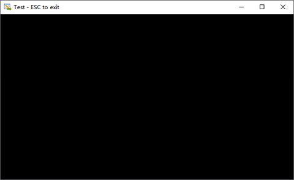
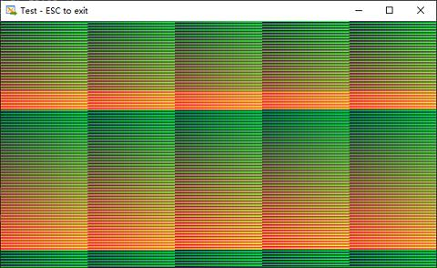
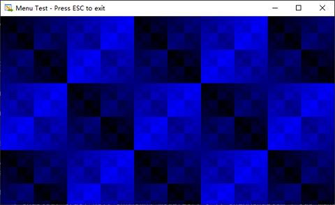

# GB/视频/显示输出

将图像显示在电脑屏幕上并不是一件容易的事, 它需要由相应硬件平台和操作系统所提供底层支持. 隐藏在图像背后的, 是专业的代码编写和硬件知识. 但幸运的是, 一些开源 GUI(图形用户界面)库可以简化这些操作.

本小节将学习如何使用 MiniFB 将一个三维矩阵以图像的形式绘制在电脑屏幕上.

## MiniFB: 小型跨平台 GUI 库

世界上有许多知名的 GUI 库, 例如 openGL 等, 不过鉴于该库入门难度较高且提供了太多不需要的额外功能, 因此本书将采用另一个非常简单且 API 很友好的 GUI 库: MiniFB(Mini FrameBuffer). MiniFB 是一个小型跨平台库, 可以在窗口中轻松渲染像素. 它提供的功能不太多也不太少, 正好用以实现一个硬件仿真器!

一个示例是展示其工作原理的最佳方式. 在下面的例子中, 我们将创作一个简单的带有闪烁画面的动画.

首先导入 minifb 的依赖, 同时声明动画的长宽 WIDTH 和 HEIGHT.

```rs
extern crate minifb;

use minifb::{Key, Window, WindowOptions};

const WIDTH: usize = 640;
const HEIGHT: usize = 360;
```

使用如下代码初始化窗口. 窗口名称为"Test – ESC to exit", 且窗口配置采用默认的 WindowOptions.

```rs
let mut buffer: Vec<u32> = vec![0; WIDTH * HEIGHT];

let mut window = Window::new(
    "Test - ESC to exit",
    WIDTH,
    HEIGHT,
    WindowOptions::default(),
)
.unwrap_or_else(|e| {
    panic!("{}", e);
});
```

配置窗口的刷新率, 此处约为 60 FPS.

```rs
window.limit_update_rate(Some(std::time::Duration::from_micros(16600)));
```

创建一个循环, 实时从 buffer 对象中取出数据并更新到窗口里. 注意当用户按下 ESC 时, 循环体将结束, 程序退出. 由于在代码中强制设置了 buffer 内全部数据都为 0, 因此实际运行代码后, 一个全黑的窗口将会展示.

```rs
while window.is_open() && !window.is_key_down(Key::Escape) {
    for i in buffer.iter_mut() {
        *i = 0;
    }

    window
        .update_with_buffer(&buffer, WIDTH, HEIGHT)
        .unwrap();
}
```



如果只是黑屏的话, 那可就太无趣了. 下面来给代码加点东西, 让它"动"起来! 要修改的地方是循环体部分, 使用一个变量 j 来让 buffer 内的数据有规律的变化.

```rs
let mut j: u32 = 0;
while window.is_open() && !window.is_key_down(Key::Escape) {
    for i in buffer.iter_mut() {
        *i = j * 128; // write something more funny here!
        j = j.wrapping_add(1);
    }
}
```

重新运行程序, 一个规律闪烁的动画便出现在眼前.



读者可以随意修改上述代码, 试试能做出什么动画! 例如下图所示规则的色块, 或者一个渐变色画面? 它们都只需要用一点点的数学公式来设置 buffer 内的数据, 试试自己动手吧!



MiniFB 除了显示图像外, 还能实现许多基本的 GUI 功能, 比如检测鼠标单击/双击事件, 键盘按键事件, 和为程序添加菜单等功能(太棒了! 我们正需要监听键盘事件以便模拟 Game Boy 的游戏手柄).

## 为仿真器实现 main 函数

Game Boy 中 GPU 的工作可用如下的文字描述: 对于 Game Boy, GPU 输出代表灰度图像的二维矩阵; 对于 Game Boy Color, GPU 则输出代表彩色图像的三维矩阵. Game Boy 的显示屏是尺寸为 160x144 的像素 LCD 屏幕. 在仿真器的代码实现上, 本书将统一采用三维矩阵来表示灰度或彩色图像, 如果 LCD 中的每个像素都被视为一个 3 维矩阵中第二维度的一个元素, 则可以对宽度为 160 和高度为 144 的屏幕进行直接映射.

```rs
pub const SCREEN_W: usize = 160;
pub const SCREEN_H: usize = 144;

pub struct Gpu {
    pub data: [[[u8; 3]; SCREEN_W]; SCREEN_H],
}
```

借助于 MiniFB, GPU 中的 data 数据现已可以被正常显示在 PC 屏幕上. 下面将为 Game Boy 仿真器添加 main 函数, 在 main 函数中 MiniFB 会循环读取 GPU 中的 data 数据并显示在窗口中.

```rs
use gameboy::apu::Apu;
use gameboy::gpu::{SCREEN_H, SCREEN_W};
use gameboy::motherboard::MotherBoard;
use std::cmp;
use std::thread;

fn main() {
    let mut rom = String::from("");
    let mut c_scale = 2;
    {
        let mut ap = argparse::ArgumentParser::new();
        ap.set_description("Gameboy emulator");
        ap.refer(&mut c_scale)
            .add_option(&["-x"], argparse::Store, "Scale the video");
        ap.refer(&mut rom).add_argument("rom", argparse::Store, "Rom name");
        ap.parse_args_or_exit();
    }

    let mut mbrd = MotherBoard::power_up(rom);
    let rom_name = mbrd.mmu.borrow().cartridge.title();

    let mut option = minifb::WindowOptions::default();
    option.resize = true;
    option.scale = match c_scale {
        1 => minifb::Scale::X1,
        2 => minifb::Scale::X2,
        4 => minifb::Scale::X4,
        8 => minifb::Scale::X8,
        _ => panic!("Supported scale: 1, 2, 4 or 8"),
    };
    let mut window =
        minifb::Window::new(format!("Gameboy - {}", rom_name).as_str(), SCREEN_W, SCREEN_H, option).unwrap();
    let mut window_buffer = vec![0x00; SCREEN_W * SCREEN_H];
    window.update_with_buffer(window_buffer.as_slice()).unwrap();

    loop {
        // Stop the program, if the GUI is closed by the user
        if !window.is_open() {
            break;
        }

        // Execute an instruction
        mbrd.cpu.next();

        // Update the window
        if NEED_UPDATE_WINDOW {
            let mut i: usize = 0;
            for l in mbrd.mmu.borrow().gpu.data.iter() {
                for w in l.iter() {
                    let b = u32::from(w[0]) << 16;
                    let g = u32::from(w[1]) << 8;
                    let r = u32::from(w[2]);
                    let a = 0xff00_0000;

                    window_buffer[i] = a | b | g | r;
                    i += 1;
                }
            }
            window.update_with_buffer(window_buffer.as_slice()).unwrap();
        }
    }

    mbrd.mmu.borrow_mut().cartridge.sav();
}
```

由于目前并没有更新 GPU 中的 data 数据, 如果读者此时运行代码, 将得到一个纯黑的 160x144 大小的窗口. 那么接下来的工作就非常明了了: 在 data 里填充游戏每一帧的画面数据!
