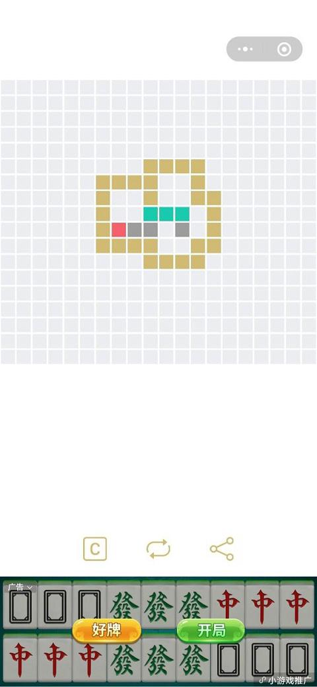

# 独立游戏开发/Cocos Creator 微信小游戏广告接入

我在 06 月 13 日上线了小游戏《像素推箱》后, 在 6 月 28 日终于完成了 1000 人注册的任务, 今天顺利开通了微信流量主. 我在早上 7 点多的时候看到注册数突破 1000 人, 但流量主的 "开通" 按钮还是灰色的, 到 8 点钟左右 "开通" 按钮就可以点击了, 看来微信是每天早上 8 点做的定时任务, 笑.

## 如何添加 Banner 广告位

0. 审核通过流量主资格: 首先, 确保你已经通过了微信小程序流量主的审核, 并且在小程序后台成功开通了流量主功能.
0. 登录小程序后台: 使用你的小程序管理员账号登录微信公众平台的小程序后台(https://mp.weixin.qq.com).
0. 进入广告位管理: 在小程序后台的菜单栏中, 点击"推广", 然后选择"流量主", 接着点击"广告位管理".
0. 创建广告位: 在广告位管理页面, 点击"创建广告位".
0. 选择广告位类型: 在创建广告位页面, 选择 "Banner 广告位" 作为广告位类型.
0. 复制广告代码
0. 添加倒 Cocos Creator 游戏项目中.

## 底部自适应

我们选择将 Banner 广告位添加到小游戏的底部. 这里据网上说法, 不能把 Banner 广告添加到页面顶部, 理由是会阻挡微信默认两个按钮(分享和关闭).

为了使广告始种保持在底部, 需要我们在载入广告后判断一下广告的高度, 然后动态设置广告的坐标. 理论上将广告坐标设置为 `wx.getSystemInfoSync().windowHeight - size.height` 就可以了, 但在我的手机上广告却会离屏幕底部有一条 1 像素的白边, 调试无果, 因此我实际使用了 `ad.style.top = wx.getSystemInfoSync().windowHeight - size.height + 1`.

```ts
if (sys.platform == sys.Platform.WECHAT_GAME) {
    let ad = wx.createBannerAd({
        adUnitId: 'adunit-fe300a9fb1b2e275',
        adIntervals: 300,
        style: {
            left: 0,
            top: 0,
            height: 0,
            width: wx.getSystemInfoSync().windowWidth
        }
    })
    ad.onResize((size) => {
        ad.style.top = wx.getSystemInfoSync().windowHeight - size.height + 1
    })
    ad.onError((err) => {
        console.log(err)
    })
    ad.show()
}
```

**实际广告界面**



欢迎访问微信小游戏 "像素推箱" 了解我的第一款独立游戏.


