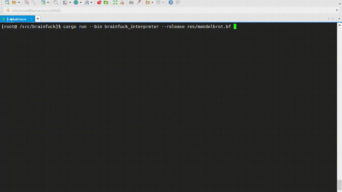
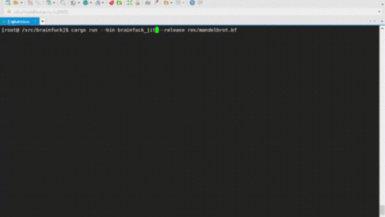

# JIT 编译器原理简述/原理简述

本系列共分为三篇, 其中第一篇部分翻译自: [https://blog.reverberate.org/2012/12/hello-jit-world-joy-of-simple-jits.html](https://blog.reverberate.org/2012/12/hello-jit-world-joy-of-simple-jits.html), 后两篇为原创. 在此特别感谢第一篇的原作者, 他的文字给了我非常多的启发.

"JIT" 一词往往会唤起工程师内心最深处的恐惧和崇拜，通常这并没有什么错, 只有最核心的编译器团队才能梦想创建这种东西. 它会使你联想到 JVM 或 .NET, 这些家伙都是具有数十万行代码的超大型运行时. 你永远不会看到有人向你介绍 "Hello World!" 级别的 JIT 编译器, 但事实上只需少量代码即可完成一些有趣的工作. 本文试图改变这一点.

编写一个 JIT 编译器只需要四步, 就像把大象装到冰箱里一样.

0. 申请一段可写和可执行的内存
0. 将源码翻译为机器码(通常经过汇编)
0. 将机器码写入第一步申请的内存
0. 执行这部分内存

## Hello, JIT World: The Joy of Simple JITs

事不宜迟, 让我们跳进我们的第一个 JIT 程序. 该代码是特定于 64 位 Unix 的, 因为它使用了 `mmap()`. 鉴于此读者需要拥有支持该代码的处理器和操作系统.

```c
#include <stdio.h>
#include <stdlib.h>
#include <string.h>
#include <sys/mman.h>

int main(int argc, char *argv[]) {
  // Machine code for:
  //   mov eax, 0
  //   ret
  unsigned char code[] = {0xb8, 0x00, 0x00, 0x00, 0x00, 0xc3};

  if (argc < 2) {
    fprintf(stderr, "Usage: jit1 <integer>\n");
    return 1;
  }

  // Overwrite immediate value "0" in the instruction
  // with the user's value.  This will make our code:
  //   mov eax, <user's value>
  //   ret
  int num = atoi(argv[1]);
  memcpy(&code[1], &num, 4);

  // Allocate writable/executable memory.
  // Note: real programs should not map memory both writable
  // and executable because it is a security risk.
  void *mem = mmap(NULL, sizeof(code), PROT_WRITE | PROT_EXEC,
                   MAP_ANON | MAP_PRIVATE, -1, 0);
  memcpy(mem, code, sizeof(code));

  // The function will return the user's value.
  int (*func)() = mem;
  return func();
}
```

似乎很难相信上面的 33 行代码是一个合法的 JIT. 它动态生成一个函数, 该函数返回运行时指定的整数, 然后运行该函数. 读者可以验证其是否正常运行:

```sh
$ gcc -o jit jit.c
$ ./jit 42
$ echo $?
# 42
```

您会注意到, 代码中使用 `mmap()` 分配内存, 而不是使用 `malloc()` 从堆中获取内存的常规方法. 这是必需的, 因为我们需要内存是可执行的, 因此我们可以跳转到它而不会导致程序崩溃. 在大多数系统上, 栈和堆都配置为不允许执行, 因为如果您的代码跳转到了栈或堆, 则意味着程序发生了很大的错误, 这是由操作系统的内存结构决定的(见下图). 更糟糕的是, 利用缓冲区溢出的黑客可以使用可执行堆栈来更轻松地利用该漏洞. 因此, 通常我们希望避免映射任何可写和可执行的内存, 这也是在您自己的程序中遵循此规则的好习惯. 我在上面打破了这个规则, 但这只是为了使我们的第一个程序尽可能简单.

恭喜, 您已经学会了如何编写一个 JIT 编译器, 那么后面我们会尝试干些什么事情呢? 我准备为一门世界上最简单的语言编写 JIT 编译器. 它叫做 Brainfuck, 最小的图灵完备机器. 大部分初学者都能在 40 行代码里完成它的解释器, 但此时我会稍微透露一点信息, 使用 IR 优化后的解释器将比纯解释执行快 5 倍左右, 而在采用 JIT 编译后将至少快 60 倍.

您可以先自己尝试去了解 Brainfuck 这门语言, 也可以直接阅读下一章, 这完全取决于你.

**Brainfuck Interpreter**



**Brainfuck Interpreter with IR**


**Brainfuck JIT**



## 参考

- [1] [Josh Haberman. Hello, JIT World: The Joy of Simple JITs.](https://blog.reverberate.org/2012/12/hello-jit-world-joy-of-simple-jits.html)
