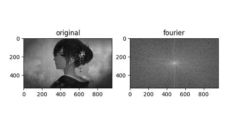

# 数字图像处理/频域滤波基础

频域是描述信号在频率方面特性时用到的一种坐标系, 频域滤波即在该坐标系下对图像进行滤波的技术.

## 傅里叶变换

[傅里叶变换](https://zh.wikipedia.org/wiki/%E5%82%85%E9%87%8C%E5%8F%B6%E5%8F%98%E6%8D%A2)是一种线性的积分变换, 常在将信号在时域(或空域)和频域之间变换时使用, 在物理学和工程学中有许多应用. 因其基本思想首先由法国学者约瑟夫·傅里叶系统地提出, 所以以其名字来命名以示纪念.

经过傅里叶变换而生成的函数 f' 称作原函数 f 的傅里叶变换、亦或其频谱. 在许多情况下, 傅里叶变换是可逆的, 即可通过 f' 得到其原函数 f. 通常情况下, f 是实数函数, 而 f' 则是复数函数, 用一个复数来表示振幅和相位.

## 频域中的滤波基础

1. 将 M * N 大小的图像扩展到 2M * 2N, 多余像素以 0 填充
2. 用 (-1)^{M+N} 乘以输入图像进行中心变换
3. 计算图像的 DFT, 即 F(u, v)
4. 用滤波器函数 H(u, v) 乘以 F(u, v)
5. 计算 4 中结果的反 DFT
6. 得到 5 中结果的实部
7. 用 (-1)^{M+N} 乘以 6 中的结果
8. 提取 7 中结果左上象限 M * N 大小的区域


F(u, v) 的中心部分为低频信号, 边缘部分为高频信号. 高频信号保存了图像的细节. H(u, v) 也被称为滤波器. 输出图像的傅里叶变换为:

```text
G(u, v) = F(u, v) * H(u, v)
```

H 与 F 的相乘涉及二维函数, 并在逐元素的基础上定义. 即 H 的第一个元素乘以 F 的第一个元素, H 的第二个元素乘以 F 的第二个元素, 以此类推.

## 相关代码

```py
# 图像的傅里叶变换与反变换
import numpy as np
import scipy.misc
import PIL.Image
import matplotlib.pyplot as plt

im = PIL.Image.open('/img/jp.jpg')
im = im.convert('L')
im_mat = np.asarray(im)
rows, cols = im_mat.shape

# 扩展 M * N 图像到 2M * 2N
im_mat_ext = np.zeros((rows * 2, cols * 2))
for i in range(rows):
    for j in range(cols):
        im_mat_ext[i][j] = im_mat[i][j]

# 傅里叶变换
im_mat_fu = np.fft.fft2(im_mat_ext)
# 将低频信号移植中间, 等效于在时域上对 f(x, y) 乘以 (-1)^(m + n)
im_mat_fu = np.fft.fftshift(im_mat_fu)

# 显示原图
plt.subplot(121)
plt.imshow(im_mat, 'gray')
plt.title('original')
plt.subplot(122)
# 在显示频率谱之前, 对频率谱取实部并进行对数变换
plt.imshow(np.log(np.abs(im_mat_fu)), 'gray')
plt.title('fourier')
plt.show()

# 傅里叶反变换
im_converted_mat = np.fft.ifft2(np.fft.ifftshift(im_mat_fu))
# 得到傅里叶反变换结果的实部
im_converted_mat = np.abs(im_converted_mat)
# 提取左上象限
im_converted_mat = im_converted_mat[0:rows, 0:cols]
# 显示图像
im_converted = PIL.Image.fromarray(im_converted_mat)
im_converted.show()
```

图像与其频率谱图像:


