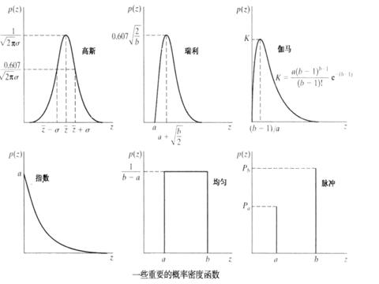
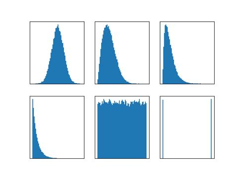

# 数字图像处理/噪声

图像噪声是指存在于图像数据中的不必要的或多余的干扰信息. 噪声的存在严重影响了遥感图像的质量, 因此在图像增强处理和分类处理之前, 必须予以纠正. 噪声在理论上可以定义为"不可预测, 只能用概率统计方法来认识的随机误差". 因此将图像噪声看成是多维随机过程是合适的, 因而描述噪声的方法完全可以借用随机过程的描述, 即用其概率分布函数和概率密度分布函数.

## 一些重要噪声的概率密度函数



## 如何生成指定类型的噪声

```py
import matplotlib.pyplot as plt
import numpy as np

# 高斯噪声: 均值为 0, 标准差为 64
x1 = np.random.normal(loc=0, scale=64, size=(256, 256))

# 瑞利噪声: (2 / b) ** 0.5 为 1
x2 = np.random.rayleigh(scale=64, size=(256, 256))

# 伽马噪声: (b-1) / a 为 2, 放大 32 倍
x3 = np.random.gamma(shape=2, scale=32, size=(256, 256))

# 指数噪声: a = 1/32
x4 = np.random.exponential(scale=32, size=(256, 256))

# 均匀噪声
x5 = np.random.uniform(low=0, high=1.0, size=(256, 256))

# 脉冲噪声
x6 = np.random.random_integers(low=0.1, high=2.0, size=(256, 256))

for i, x in enumerate([x1, x2, x3, x4, x5, x6]):
    ax = plt.subplot(23 * 10 + i + 1)
    ax.hist(x.reshape(x.size), 64, normed=True)
    ax.set_yticks([])
    ax.set_xticks([])
plt.show()
```

输出结果:


